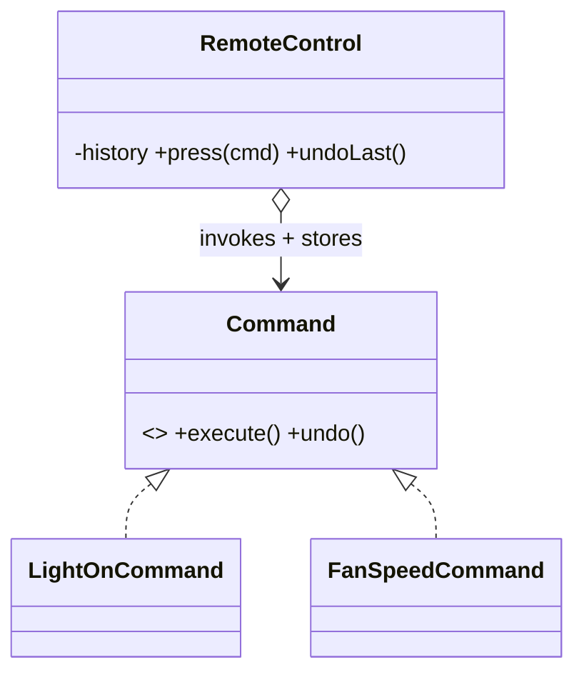

# Command

> **Section 06 — Design Patterns › Behavioral** · Code: [C++](C++%20Code/example.cpp) · [Java](Java%20Code/Main.java)

**Intent:** encapsulate a request as an object. This lets you parameterize an invoker with requests, queue/log them, and support **undo**.

**Domain:** a smart-home remote. Each button press is a `Command` object that knows how to `execute()` **and** `undo()` itself, so the remote gets undo for free.



- A command binds a **receiver** (Light/Fan) and remembers the previous value so `undo()` can reverse it.
- The invoker keeps a history stack. Section 09 applies this to an editor's undo/redo + macros.

## How to run
```powershell
cd "06 - Design Patterns/Behavioral/Command/C++ Code"
g++ -std=c++14 example.cpp -o example.exe ; .\example.exe
# Java: cd "../Java Code" ; javac Main.java ; java Main
```

### Expected output (identical in C++ and Java)
```
  light ON
  fan speed = 3
  fan speed = 5
Undo twice:
  [undo]
  fan speed = 3
  [undo]
  fan speed = 0
```
