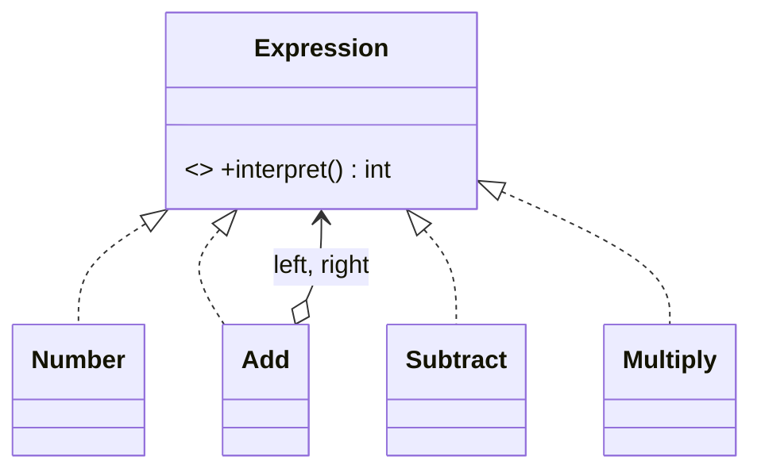

# Interpreter

> **Section 06 — Design Patterns › Behavioral** · Code: [C++](C++%20Code/example.cpp) · [Java](Java%20Code/Main.java)

**Intent:** for a given language, define a class per grammar rule plus an interpreter that evaluates sentences. Evaluating = walking the resulting tree.

**Domain:** a tiny arithmetic evaluator. `(3 + (10 - 4)) * 2` is built as a tree of `Expression` objects (`Number`, `Add`, `Subtract`, `Multiply`) and evaluated. This is how calculators, rule engines, and query languages work internally.



- **Terminal** expressions (`Number`) are leaves; **non-terminals** (`Add`…) hold sub-expressions.
- `interpret()` recurses; `toString()` pretty-prints the tree. Section 09 applies this to a discount/feature-flag rule engine.

## How to run
```powershell
cd "06 - Design Patterns/Behavioral/Interpreter/C++ Code"
g++ -std=c++14 example.cpp -o example.exe ; .\example.exe
# Java: cd "../Java Code" ; javac Main.java ; java Main
```

### Expected output (identical in C++ and Java)
```
  expression: ((3 + (10 - 4)) * 2)
  result:     18
```
