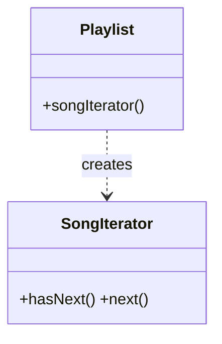

# Iterator

> **Section 06 — Design Patterns › Behavioral** · Code: [C++](C++%20Code/example.cpp) · [Java](Java%20Code/Main.java)

**Intent:** access the elements of a collection sequentially **without exposing its underlying representation**. The collection can change its internal storage and clients that use the iterator don't care.

**Domain:** a `Playlist`. Clients traverse songs via `hasNext()`/`next()` without knowing it's backed by a vector/list.



- The GoF-style explicit iterator (`hasNext`/`next`) is shown alongside each language's **native** iteration (C++ range-`for` via `begin()/end()`; Java `Iterable` for-each).
- Section 09 applies this to a lazily-paginated API feed.

## How to run
```powershell
cd "06 - Design Patterns/Behavioral/Iterator/C++ Code"
g++ -std=c++14 example.cpp -o example.exe ; .\example.exe
# Java: cd "../Java Code" ; javac Main.java ; java Main
```

### Expected output (identical in C++ and Java)
```
Via explicit iterator (hasNext/next):
  - Lose Yourself
  - Numb
  - Believer
Via C++ range-for (same collection):     # Java: "Via for-each"
  * Lose Yourself
  * Numb
  * Believer
```
