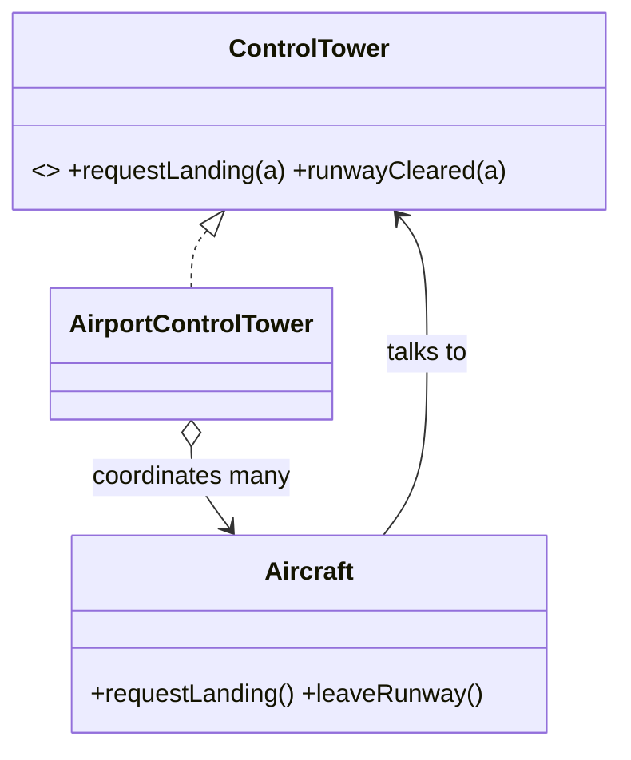

# Mediator

> **Section 06 — Design Patterns › Behavioral** · Code: [C++](C++%20Code/example.cpp) · [Java](Java%20Code/Main.java)

**Intent:** centralize how a set of objects interact in one mediator object, instead of every object referencing every other (an n-to-n mess).

**Domain:** air-traffic control. Aircraft never talk to each other — they request actions via the control tower (mediator), which serializes the single runway so two planes don't land at once.



- All coordination logic (the runway queue) lives in **one** place — the mediator.
- Colleagues stay decoupled from each other. Section 09 applies this to a smart-home automation hub.

## How to run
```powershell
cd "06 - Design Patterns/Behavioral/Mediator/C++ Code"
g++ -std=c++14 example.cpp -o example.exe ; .\example.exe
# Java: cd "../Java Code" ; javac Main.java ; java Main
```

### Expected output (identical in C++ and Java)
```
AI-101: requesting permission to land
  AI-101: CLEARED -> landing
6E-202: requesting permission to land
  6E-202: HOLD (runway busy)
UK-303: requesting permission to land
  UK-303: HOLD (runway busy)
...time passes...
AI-101: taxied off the runway
  6E-202: CLEARED -> landing
6E-202: taxied off the runway
  UK-303: CLEARED -> landing
```
