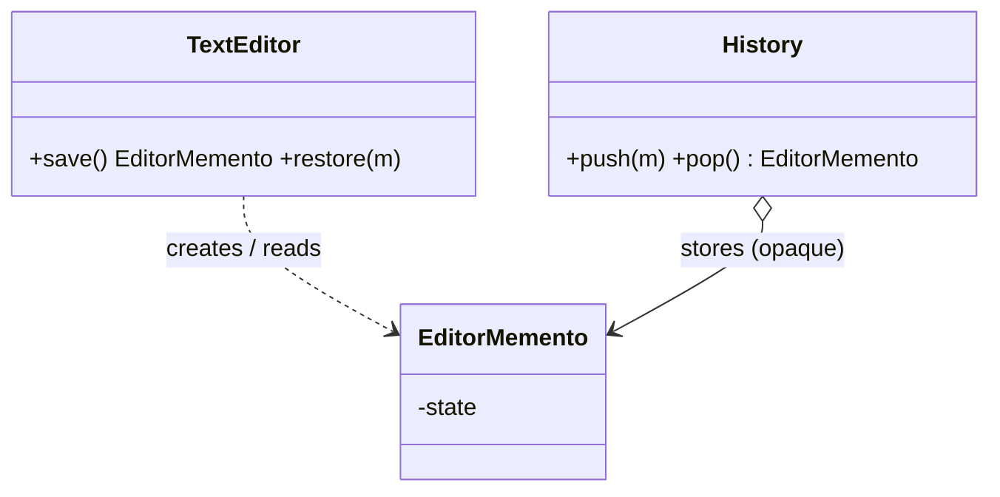

# Memento

> **Section 06 — Design Patterns › Behavioral** · Code: [C++](C++%20Code/example.cpp) · [Java](Java%20Code/Main.java)

**Intent:** capture an object's internal state in a separate object so it can be restored later, **without exposing the object's internals**. This is how undo/checkpoint features are built.

**Domain:** a text editor saves snapshots and undoes back to them. The snapshot (`EditorMemento`) is opaque to the history keeper — it stores it but can't read or tamper with the editor's private state.



- Three roles: **originator** (editor), **memento** (snapshot), **caretaker** (history).
- In C++ the memento's content is readable only by its `friend` originator. (Java's access model is looser; the intent is the same.) Section 09 applies this to game-save checkpoints.

## How to run
```powershell
cd "06 - Design Patterns/Behavioral/Memento/C++ Code"
g++ -std=c++14 example.cpp -o example.exe ; .\example.exe
# Java: cd "../Java Code" ; javac Main.java ; java Main
```

### Expected output (identical in C++ and Java)
```
  current : Hello, world!!! (oops, too much)
  undo -> : Hello, world
  undo -> : Hello
```
