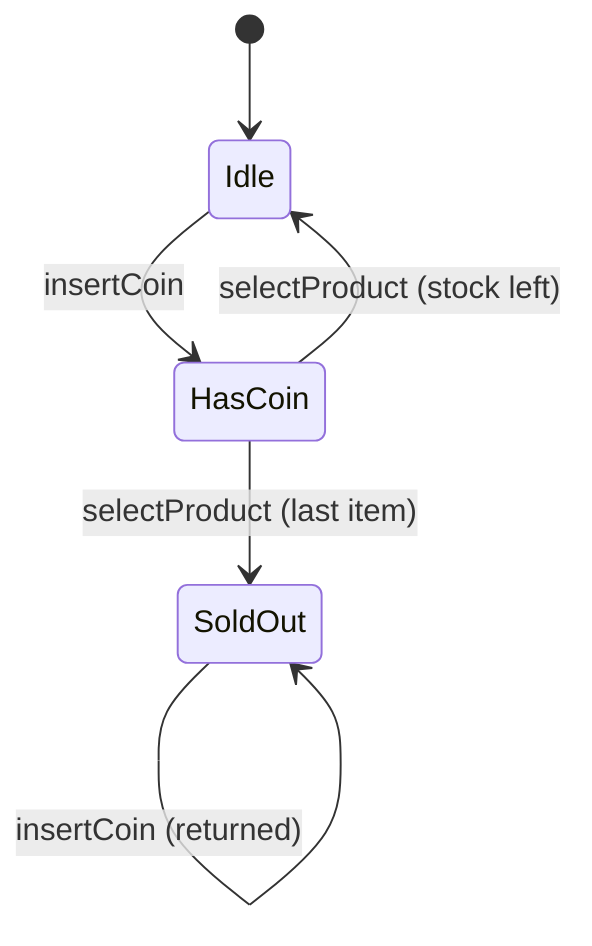

# State

> **Section 06 — Design Patterns › Behavioral** · Code: [C++](C++%20Code/example.cpp) · [Java](Java%20Code/Main.java)

**Intent:** let an object alter its behaviour when its internal state changes — it appears to change its class. Each state is a class; the context delegates to the current state, which also decides the next state. Replaces a tangle of `if/else` on a status field.

**Domain:** a vending machine. `insertCoin()` / `selectProduct()` behave entirely differently when it's `Idle`, `HasCoin`, or `SoldOut`.



- Each state class implements the same interface; transitions are just `setState(new XxxState())`.
- This maps 1:1 onto the [state diagrams](../../../04%20-%20UML%20Diagrams/Notes.md) from section 04. Section 09 applies it to a support-ticket lifecycle.

## How to run
```powershell
cd "06 - Design Patterns/Behavioral/State/C++ Code"
g++ -std=c++14 example.cpp -o example.exe ; .\example.exe
# Java: cd "../Java Code" ; javac Main.java ; java Main
```

### Expected output (identical in C++ and Java)
```
[Idle] insert a coin first
[Idle] coin accepted
[HasCoin] dispensing... (1 left)
[Idle] coin accepted
[HasCoin] dispensing... (0 left)
[SoldOut] machine sold out - coin returned
```
