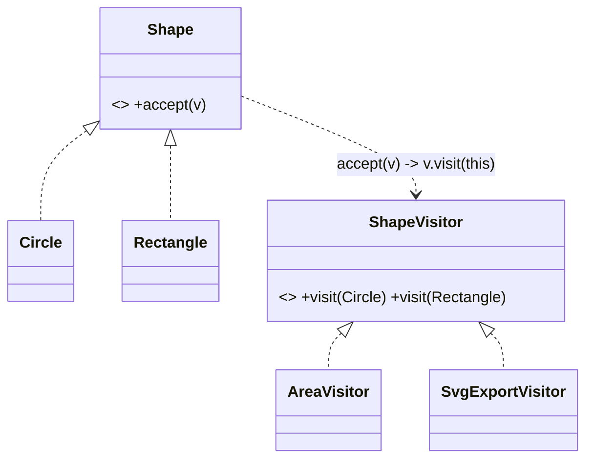

# Visitor

> **Section 06 — Design Patterns › Behavioral** · Code: [C++](C++%20Code/example.cpp) · [Java](Java%20Code/Main.java)

**Intent:** represent an operation to perform on the elements of an object structure. Visitor lets you add **new operations** to a class hierarchy **without modifying** the element classes — the operation lives in a visitor.

**Domain:** a vector-graphics document of shapes (`Circle`, `Rectangle`). We add operations — total area, SVG export — without editing the shapes each time. Each operation is a visitor.



- **Double dispatch:** `shape.accept(visitor)` calls back `visitor.visit(thisConcreteShape)`, so the right code runs for the real shape + the real operation.
- Trade-off: adding an *operation* is easy (new visitor); adding an *element type* is harder (touch every visitor). Section 09 applies this to shopping-cart operations (tax/invoice).

## How to run
```powershell
cd "06 - Design Patterns/Behavioral/Visitor/C++ Code"
g++ -std=c++14 example.cpp -o example.exe ; .\example.exe
# Java: cd "../Java Code" ; javac Main.java ; java Main
```

### Expected output
```
Total area: 27.708
SVG export:
  <circle r="2"/>
  <rect w="3" h="4"/>
  <circle r="1"/>
```
> Java prints the area in full precision (`27.70795`) and dimensions with `.0` (`r="2.0"`) — display only; the geometry is identical.
