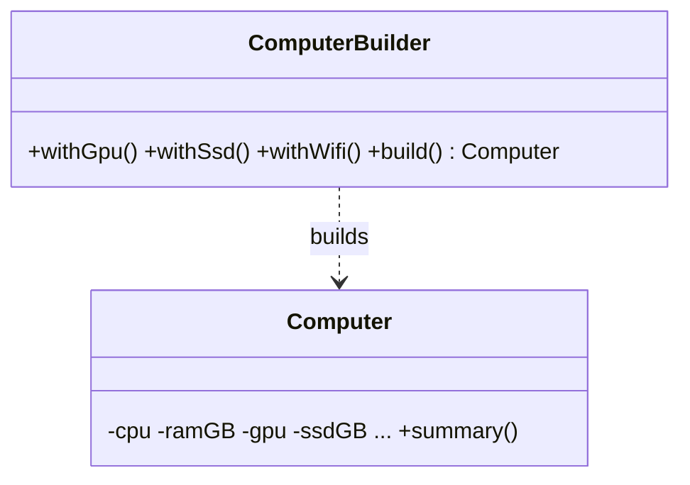

# Builder

> **Section 06 — Design Patterns › Creational** · Code: [C++](C++%20Code/example.cpp) · [Java](Java%20Code/Main.java)

**Intent:** construct a complex object **step by step**, keeping it consistent with many optional fields — no "telescoping constructor" (a constructor with 8 parameters).

**Domain:** assembling a custom `Computer`. A few required parts (CPU, RAM) and many optional ones (GPU, SSD, liquid cooling, Wi-Fi). A fluent builder reads like a sentence and makes intent obvious.



- Each `with...()` returns the builder, so calls **chain**; order doesn't matter.
- `build()` is the single place that **validates** (CPU + RAM required) and hands back a finished product.
- In Java the builder is a `static` nested class so it can set the product's private fields.

## How to run
```powershell
cd "06 - Design Patterns/Creational/Builder/C++ Code"
g++ -std=c++14 example.cpp -o example.exe ; .\example.exe
```
```powershell
cd "06 - Design Patterns/Creational/Builder/Java Code"
javac Main.java ; java Main
```

### Expected output (identical in C++ and Java)
```
Office build:
  Computer { CPU=Intel i5, RAM=16GB, GPU=integrated, SSD=512GB, liquidCooled=no, wifi=yes }
Gaming build:
  Computer { CPU=Ryzen 9, RAM=64GB, GPU=RTX 4090, SSD=2000GB, liquidCooled=yes, wifi=yes }
```
