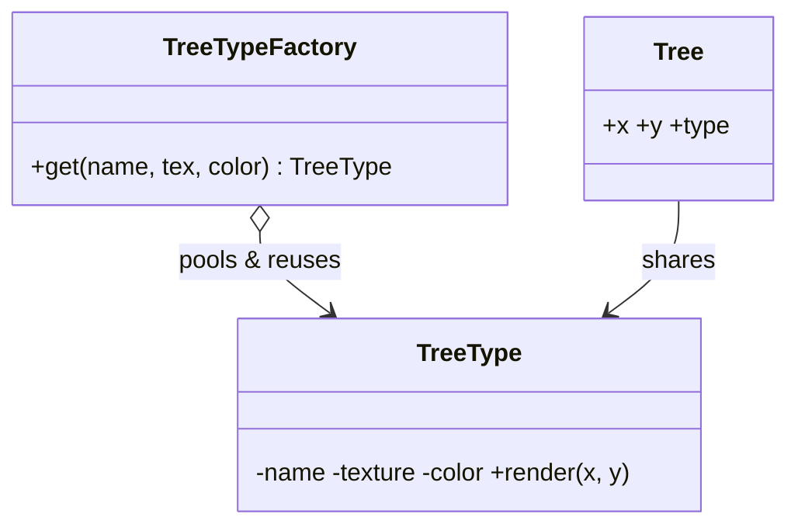

# Flyweight

> **Section 06 — Design Patterns › Structural** · Code: [C++](C++%20Code/example.cpp) · [Java](Java%20Code/Main.java)

**Intent:** share common (**intrinsic**) state across many objects so you can support huge numbers of them cheaply. Per-object (**extrinsic**) state is passed in from outside.

**Domain:** a map renders a forest of trees. Each tree's mesh/texture/color is shared by thousands of trees (intrinsic, stored once in a factory); only x/y position is unique per tree (extrinsic).



- The **factory** returns an existing flyweight for the same key, creating it only once.
- 5 trees, 2 distinct `TreeType` objects — the memory win scales to millions.

## How to run
```powershell
cd "06 - Design Patterns/Structural/Flyweight/C++ Code"
g++ -std=c++14 example.cpp -o example.exe ; .\example.exe
# Java: cd ../Java Code ; javac Main.java ; java Main
```

### Expected output (identical in C++ and Java)
```
  draw green Oak [tex:oak.png] at (10,20)
  draw green Oak [tex:oak.png] at (15,25)
  draw dark-green Pine [tex:pine.png] at (30,12)
  draw dark-green Pine [tex:pine.png] at (33,18)
  draw green Oak [tex:oak.png] at (40,40)
5 trees rendered using only 2 shared TreeType objects.
```
