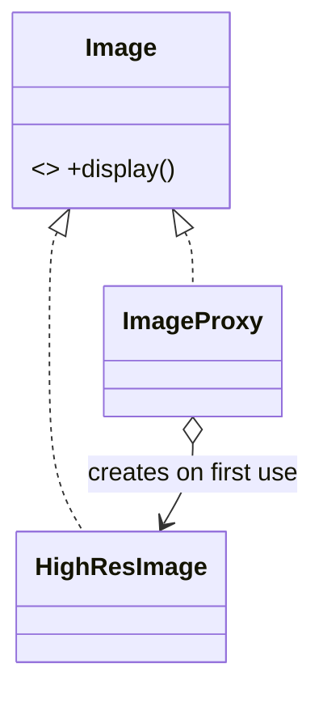

# Proxy

> **Section 06 — Design Patterns › Structural** · Code: [C++](C++%20Code/example.cpp) · [Java](Java%20Code/Main.java)

**Intent:** provide a surrogate for another object to **control access** to it. The proxy implements the same interface as the real object, so clients can't tell the difference — but it can add lazy-loading, access control, caching, or logging.

**Domain:** a document viewer with many high-res images. A **virtual proxy** defers the expensive disk load until an image is first displayed (and never loads ones you don't view).



- Same interface ⇒ the client code is unchanged whether it holds the real object or the proxy.
- Flavours: **virtual** (lazy, shown here), **protection** (access control), **remote** (stand-in for a remote object), **caching**. Section 09 builds a caching + access-control proxy.

## How to run
```powershell
cd "06 - Design Patterns/Structural/Proxy/C++ Code"
g++ -std=c++14 example.cpp -o example.exe ; .\example.exe
# Java: cd ../Java Code ; javac Main.java ; java Main
```

### Expected output (identical in C++ and Java)
```
Opening document with 3 images (note: no disk loads yet):

User scrolls to image 1:
  [disk] loading large image photo1.png ... done
  showing photo1.png
User scrolls back to image 1 again:
  showing photo1.png
User scrolls to image 2:
  [disk] loading large image photo2.png ... done
  showing photo2.png

(photo3 was never displayed, so it was never loaded.)
```
