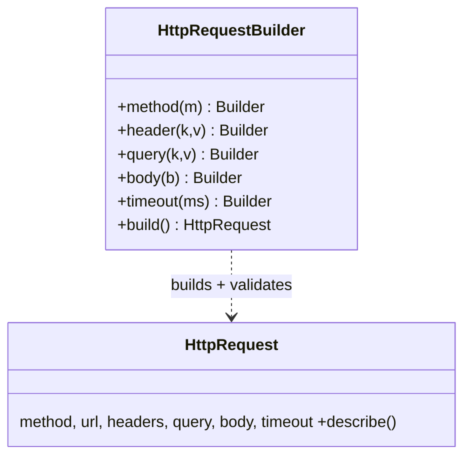

# Builder in a Real Project — a Fluent HTTP Request Builder

> **Section 09 — Design Patterns in Real Projects** · Pattern: **Builder** · Code: [src/](src/)

Section 06 taught Builder with a focused example. **Here it earns its keep**: constructing an HTTP request that has many optional parts.

---

## The scenario
An HTTP request has a **lot of optional pieces** — method, headers, query params,
body, timeout. A constructor with 6 positional arguments is unreadable
(`new Request('POST', url, {...}, {...}, body, 5000)`), and not every combination
is valid (a `GET` with a body is malformed).

**Builder** gives a readable, chainable construction (`.method().header().body()`)
and validates the invariants **once**, in `build()`.

## The design


Each setter returns `this`, which is what makes the calls **chain**. `build()`
enforces the rules (url required, no body on a GET) and hands back the finished,
valid object.

## Project layout
```
src/
  httpRequest.js   HttpRequest + HttpRequestBuilder
  index.js         the demo (valid GET, valid POST, rejected GET+body)
```

## How to run
```powershell
cd "09 - Design Patterns in Real Projects/Builder - HTTP Request"
node src/index.js
```
### Expected output
```
GET with query + headers:
  GET https://api.shop.com/products?category=books&page=2
    Accept: application/json
    timeout: 5000ms
POST with a JSON body:
  POST https://api.shop.com/orders
    Content-Type: application/json
    Authorization: Bearer xyz
    body: {"sku":"BOOK-42","qty":1}
    timeout: 30000ms
Invalid (GET with a body) is rejected at build():
  GET requests cannot have a body
```

## Key takeaway
Builder shines when an object has **many optional fields** and **validity rules**.
The fluent API reads like a sentence, and an invalid object can never escape
`build()`. (This is exactly how real HTTP clients and query builders are shaped.)
