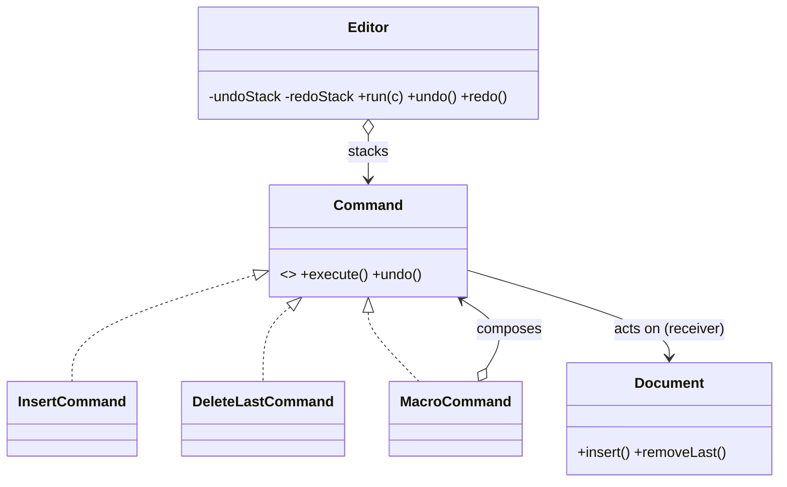

# Command in a Real Project — Editor Undo / Redo / Macros

> **Section 09 — Design Patterns in Real Projects** · Pattern: **Command** · Code: [src/](src/)

Section 06 taught Command with a focused example. **Here it earns its keep**: undo, redo, and macros in a text editor.

---

## The scenario
A text editor needs **undo** and **redo** — and ideally **macros** (record a few
edits, replay or undo them as a unit). The trick: the editor mustn't hard-code
*"to undo an insert, delete N chars"* for every operation.

**Command** turns each edit into an object with `execute()` and `undo()`. The
editor (the *invoker*) just pushes them onto an undo stack and pops to reverse —
it never needs to know what any command actually does.

## The design


`MacroCommand` is also a **Composite** of commands — `undo()` reverses its
children in reverse order, so a whole macro undoes atomically.

## Project layout
```
src/
  commands.js   Document (receiver) + Insert / DeleteLast / Macro commands
  editor.js     Editor (invoker: undo/redo stacks)
  index.js      the demo
```

## How to run
```powershell
cd "09 - Design Patterns in Real Projects/Command - Editor Undo and Redo"
node src/index.js
```
### Expected output
```
  type 'Hello' -> "Hello"
  type ' World' -> "Hello World"
  undo -> "Hello"
  redo -> "Hello World"
  delete 6 -> "Hello"
  undo -> "Hello World"
  macro(+'!!!' +'??') -> "Hello World!!!??"
  undo -> "Hello World"
```

## Key takeaway
Because every edit is a reversible object, the editor's undo/redo is **generic** —
adding a new edit type (e.g. "uppercase selection") needs no change to `Editor`.
That decoupling of *invoker* from *receiver* is the heart of Command.
