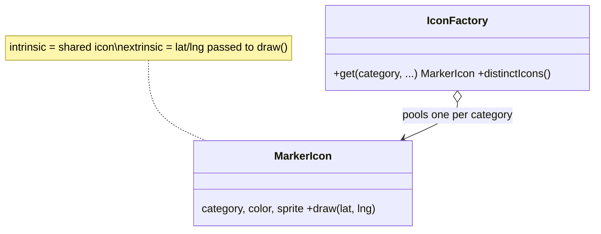

# Flyweight in a Real Project — Map Markers

> **Section 09 — Design Patterns in Real Projects** · Pattern: **Flyweight** · Code: [src/](src/)

Section 06 taught Flyweight with a focused example. **Here it earns its keep**: drawing thousands of map markers without thousands of icon copies.

---

## The scenario
A map shows thousands of markers, but only a handful of **icon types**
(restaurant, fuel, ATM…). If every marker stored its own copy of a sprite +
colour + category, you'd waste huge amounts of memory on duplicates.

**Flyweight** separates the **intrinsic** state (the shared, heavy icon) from the
**extrinsic** state (each marker's lat/lng). A factory hands out **one** icon
object per category, shared by every marker of that type.

## The design


The position is **passed into** `draw(lat, lng)` rather than stored — that's what
lets one icon serve every marker of its kind.

## Project layout
```
src/
  icons.js   MarkerIcon (flyweight) + IconFactory (pool)
  index.js   the demo (5 markers, 2 shared icons)
```

## How to run
```powershell
cd "09 - Design Patterns in Real Projects/Flyweight - Map Markers"
node src/index.js
```
### Expected output
```
    draw red restaurant [fork.png] at (12.97, 77.59)
    draw red restaurant [fork.png] at (12.98, 77.6)
    draw green fuel [pump.png] at (12.96, 77.58)
    draw green fuel [pump.png] at (12.99, 77.61)
    draw red restaurant [fork.png] at (12.95, 77.57)
5 markers share only 2 icon objects.
```

## Key takeaway
Five markers, **two** icon objects. At map scale that's millions of markers
sharing a dozen icons — the difference between smooth and out-of-memory. The
factory enforces the sharing; the trick is keeping per-instance data (position)
*out* of the flyweight.
