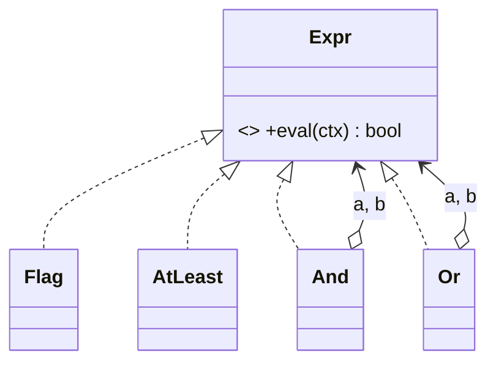

# Interpreter in a Real Project — a Rule Engine

> **Section 09 — Design Patterns in Real Projects** · Pattern: **Interpreter** · Code: [src/](src/)

Section 06 taught Interpreter with a focused example. **Here it earns its keep**: a discount / feature-flag rule engine.

---

## The scenario
Business rules change constantly: *"give the offer to members with 5+ orders, OR
to any VIP."* Hard-coding that as nested `if`s means a deploy for every tweak. You
want rules expressed as **data/structure** you can build, store, and evaluate.

**Interpreter** models a small language as a class per grammar rule. Terminal
expressions (`Flag`, `AtLeast`) read the context; non-terminals (`And`, `Or`)
combine them. The rule is an **expression tree**; `eval(ctx)` walks it.

## The design


## Project layout
```
src/
  expressions.js   Flag, AtLeast (terminals) + And, Or (non-terminals)
  index.js         build a rule tree + evaluate it against 3 users
```

## How to run
```powershell
cd "09 - Design Patterns in Real Projects/Interpreter - Rule Engine"
node src/index.js
```
### Expected output
```
Rule: (isMember AND orders>=5) OR isVIP
  Alice eligible? yes
  Bob   eligible? no
  Carol eligible? yes
```

## Key takeaway
The rule is an **object graph**, not code — so it can be built from JSON, stored
in a DB, and changed without redeploying. Add a `Not` or `Between` node = one new
class. (For very large grammars, a parser/AST or a rules DSL scales better, but
Interpreter is perfect for small, composable rule sets.)
