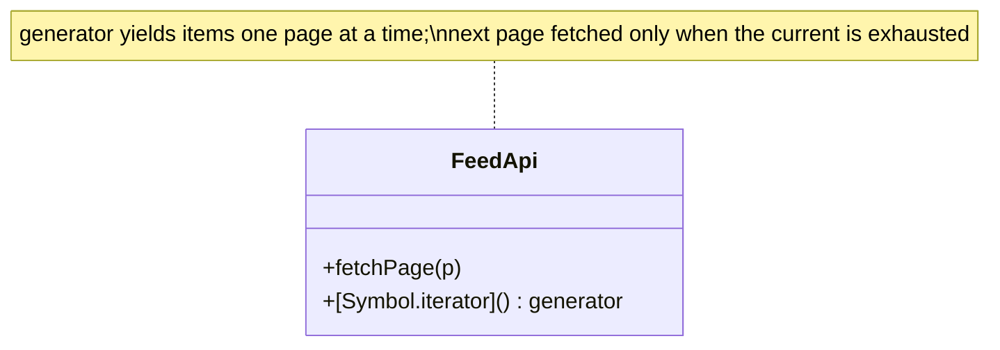

# Iterator in a Real Project — a Lazily-Paginated Feed

> **Section 09 — Design Patterns in Real Projects** · Pattern: **Iterator** · Code: [src/](src/)

Section 06 taught Iterator with a focused example. **Here it earns its keep**: scrolling an API feed where pages are fetched on demand.

---

## The scenario
A social feed has thousands of posts behind a **paginated API**. You want callers
to write a simple `for (const post of feed)` loop and **not** care about page
boundaries — and you want pages fetched **lazily**, only as far as the user scrolls.

**Iterator** exposes a uniform way to traverse a collection without revealing its
internals. In JS the idiomatic form is a **generator** bound to `[Symbol.iterator]`,
which makes the object work with `for...of` and yields items page by page.

## The design


## Project layout
```
src/
  feedApi.js   FeedApi with a generator [Symbol.iterator]
  index.js     a for...of scroll
```

## How to run
```powershell
cd "09 - Design Patterns in Real Projects/Iterator - Paginated Feed"
node src/index.js
```
### Expected output
```
Scrolling the feed (pages fetched lazily as you go):
    [api] fetch page 0
  - post#1
  - post#2
  - post#3
    [api] fetch page 1
  - post#4
  - post#5
  - post#6
    [api] fetch page 2
  - post#7
Read 7 items total.
```

## Key takeaway
The `[api] fetch page N` lines appear **interleaved** with consumption — page 1
isn't fetched until page 0's items are used up. The caller's loop stays trivial
while the iterator hides pagination and laziness. (JS generators make Iterator
nearly free.)
