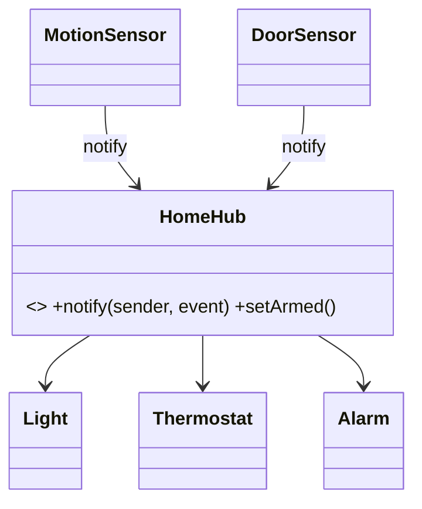

# Mediator in a Real Project — Smart-Home Automation Hub

> **Section 09 — Design Patterns in Real Projects** · Pattern: **Mediator** · Code: [src/](src/)

Section 06 taught Mediator with a focused example. **Here it earns its keep**: a smart-home hub that coordinates sensors and actuators.

---

## The scenario
A home has **sensors** (motion, door) and **actuators** (light, thermostat,
alarm). If each sensor talked directly to each actuator, you'd get a tangle of
`n×n` couplings, and the automation rules would be smeared across every device.

**Mediator** puts all the coordination in one place. Sensors report events to the
**hub**; the hub owns the rules and drives the actuators. Devices stay ignorant of
each other.

## The design


## Project layout
```
src/
  devices.js   sensors + actuators
  homeHub.js   HomeHub — the concrete Mediator (owns the rules)
  index.js     the demo (disarmed evening vs armed night)
```

## How to run
```powershell
cd "09 - Design Patterns in Real Projects/Mediator - Smart Home Hub"
node src/index.js
```
### Expected output
```
Evening, disarmed:
  [hub] armed=no
  motion detected (night)
      light ON
      thermostat -> 22C
  door opened
      (disarmed: welcome home)

Night, armed (away):
  [hub] armed=yes
  door opened
      ALARM! intruder
```

## Mediator vs Observer
**Observer** is a one-way broadcast (subject → many observers). **Mediator** is
**bidirectional coordination with logic**: the hub decides *what reacts to what*.
The same door-open event does nothing or trips the alarm — the rule lives only in
the hub. (WhatsApp's `ChatRoom` in section 08 is the same pattern.)
