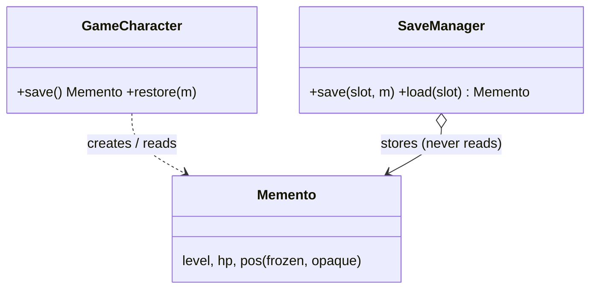

# Memento in a Real Project — Game Save / Checkpoints

> **Section 09 — Design Patterns in Real Projects** · Pattern: **Memento** · Code: [src/](src/)

Section 06 taught Memento with a focused example. **Here it earns its keep**: save points you can reload after a bad fight.

---

## The scenario
A game character has state (level, HP, position). You want **checkpoints**: save
the state, play on, and **reload** if things go wrong. But you don't want the save
system to read or corrupt the character's internals — encapsulation must hold.

**Memento** has the character produce a **snapshot of its own state** (the memento)
and restore from one. A **caretaker** (`SaveManager`) just *stores* mementos in
slots — it never looks inside them.

## The design


JS has no `friend`/package-private access, so the memento is kept opaque **by
convention**: `save()` returns a **frozen** plain object only the character
interprets.

## Project layout
```
src/
  game.js    GameCharacter (originator) + SaveManager (caretaker)
  index.js   the demo (save -> damage -> reload)
```

## How to run
```powershell
cd "09 - Design Patterns in Real Projects/Memento - Game Save"
node src/index.js
```
### Expected output
```
  after grinding: level 3, hp 100, at Forest
  [save] slot 'checkpoint'
  after the dragon fight: level 3, hp 5, at Dragon's Lair
  [load] slot 'checkpoint'
  after reload: level 3, hp 100, at Forest
```

## Key takeaway
The reload restores HP 100 and the Forest position exactly — the caretaker stored
the snapshot without ever understanding it. That separation (originator owns the
state, caretaker owns the history) is Memento, and it's how undo histories and
save systems stay encapsulated.
