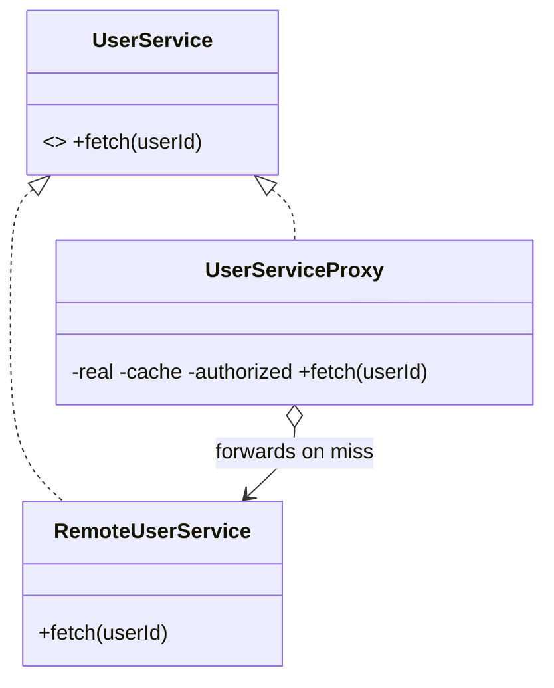

# Proxy in a Real Project — Caching + Access-Control Service

> **Section 09 — Design Patterns in Real Projects** · Pattern: **Proxy** · Code: [src/](src/)

Section 06 taught Proxy with a focused example. **Here it earns its keep**: a stand-in for a remote service that adds caching and auth transparently.

---

## The scenario
Fetching a user profile is an **expensive remote call**. You want to (a) **cache**
repeat lookups and (b) **deny** unauthorized callers — *without* changing the
real service or the calling code.

**Proxy** is a stand-in with the **same interface** as the real subject. The
client can't tell it's talking to a proxy; the proxy decides whether to serve
from cache, forward to the real service, or refuse.

## The design


Same `fetch(userId)` on both — that's why the proxy is a drop-in.

## Project layout
```
src/
  userService.js   RemoteUserService (real) + UserServiceProxy
  index.js         the demo (miss, hit, miss, denied)
```

## How to run
```powershell
cd "09 - Design Patterns in Real Projects/Proxy - Caching Service"
node src/index.js
```
### Expected output
```
First fetch u1 (miss -> remote):
    [remote] network call for u1 ...
  => profile(u1)
Second fetch u1 (cache hit):
    [proxy] cache hit for u1
  => profile(u1)
Fetch u2 (miss -> remote):
    [remote] network call for u2 ...
  => profile(u2)
Unauthorized client:
    [proxy] ACCESS DENIED
  => ''
```

## Proxy vs Decorator vs Adapter
All three wrap an object, but the **intent** differs: **Adapter** changes the
interface, **Decorator** adds behaviour to the same interface, **Proxy** controls
*access* to the same interface (cache, auth, lazy-load, remoting). Here the second
`u1` fetch never hits the network — the proxy served it.
