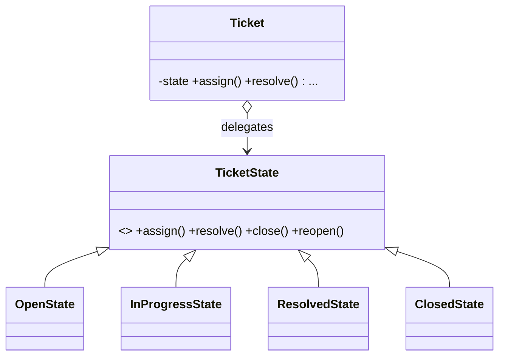

# State in a Real Project — Support-Ticket Lifecycle

> **Section 09 — Design Patterns in Real Projects** · Pattern: **State** · Code: [src/](src/)

Section 06 taught State with a focused example. **Here it earns its keep**: a support ticket whose legal actions depend on where it is in its lifecycle.

---

## The scenario
A ticket moves Open → InProgress → Resolved → Closed (and can be reopened). The
catch: which actions are **legal** depends on the current status. You *can't*
resolve a ticket that was never assigned, or assign one that's closed. Encoding
that as flags + scattered `if`s rots fast.

**State** gives each status its own class that implements only the transitions
**legal from it**, returning the next state (or `null` to reject). The ticket
(context) just delegates.

## The design


## Project layout
```
src/
  ticketState.js   the four state classes (legal transitions only)
  ticket.js        the context (delegates + adopts the next state)
  index.js         the demo
```

## How to run
```powershell
cd "09 - Design Patterns in Real Projects/State - Support Ticket"
node src/index.js
```
### Expected output
```
  ticket TICK-1: cannot 'resolve' from Open
  ticket TICK-1: assign -> InProgress
  ticket TICK-1: resolve -> Resolved
  ticket TICK-1: reopen -> InProgress
  ticket TICK-1: resolve -> Resolved
  ticket TICK-1: close -> Closed
  ticket TICK-1: cannot 'assign' from Closed
  ticket TICK-1: reopen -> InProgress
```

## State vs Strategy
Same shape (context delegates to a swappable object), different intent.
**Strategy** is chosen by the *client* to vary an algorithm. **State** changes
*itself* over time — each state decides the next. Illegal transitions are
impossible by construction, which is the whole win. (Amazon's order lifecycle and
the Vending Machine in sections 07–08 use the same pattern.)
