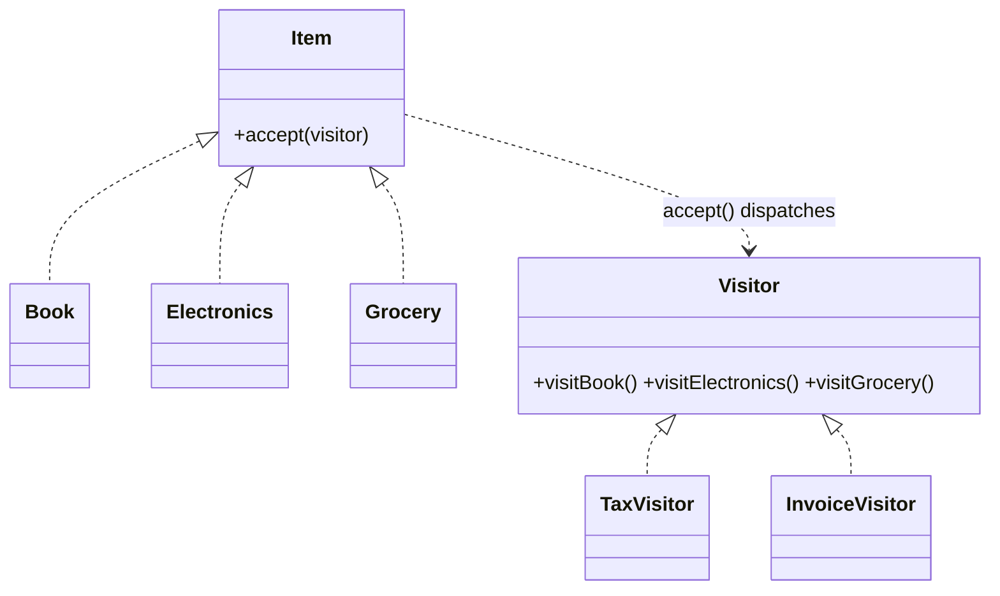

# Visitor in a Real Project — Cart Operations

> **Section 09 — Design Patterns in Real Projects** · Pattern: **Visitor** · Code: [src/](src/)

Section 06 taught Visitor with a focused example. **Here it earns its keep**: running several operations (invoice, tax) over a mixed cart of item types.

---

## The scenario
A cart holds different item types (Book, Electronics, Grocery). You need several
operations over them — print an **invoice**, compute **tax** (rates differ by
type), later maybe shipping weight. Adding a method to every item class for every
new operation bloats the model and mixes concerns.

**Visitor** moves each operation into its own class. Items expose `accept(visitor)`,
which calls the visitor's per-type method (`visitBook`, `visitElectronics`,
`visitGrocery`) — **double dispatch**. A new operation is a new visitor; the item
classes don't change.

## The design


> JS has no method overloading, so the dispatch is by **method name**
> (`visitBook` vs `visitElectronics`) rather than by argument type — same
> double-dispatch idea, expressed JS-style.

## Project layout
```
src/
  items.js     Book / Electronics / Grocery (each with accept)
  visitors.js  TaxVisitor + InvoiceVisitor (the operations)
  index.js     run both visitors over a mixed cart
```

## How to run
```powershell
cd "09 - Design Patterns in Real Projects/Visitor - Cart Operations"
node src/index.js
```
### Expected output
```
Invoice:
    Book: Clean Code - Rs 500
    Electronics: Earbuds - Rs 2000
    Grocery: Rice 5kg - Rs 400
Total tax: Rs 380
```
(Tax = 0 on the book, 18% on electronics = 360, 5% on grocery = 20 → **380**.)

## Key takeaway
Adding a "shipping weight" report = **one new visitor**, zero changes to the item
classes. The trade-off is the mirror image of most patterns: Visitor makes new
*operations* cheap but new *types* expensive (every visitor must add a method).
Use it when your **type set is stable** but operations keep growing.
